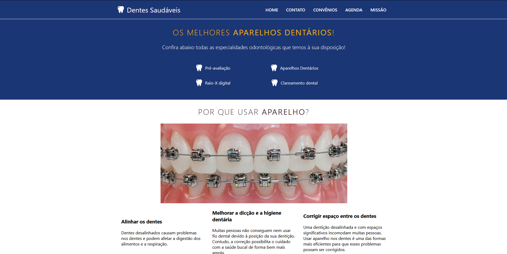

<h1>Clínica Odontológica Dentes Saudáveis 🦷</h1>
Esse projeto foi desenvolvido com react.js, é um consutório odontológico nele você consegue visualizar os convênios, contatos, fazer o agendamento e ver a missão do consutório.

<h2>O que é react  :point_down:</h2> 
O React é uma biblioteca JavaScript de código aberto com foco em criar interfaces de usuário em páginas web.

<h2 align="center">
Ferramenta utilizada para desenvolver o projeto :toolbox:
</h2>
Este projeto foi desenvolvido com o Visual Studio Code 
February 2021 (version 1.54)
<a href="https://code.visualstudio.com/download">Download</a> 

<h2 align="center">
Resultado final do projeto 🎯   
</h2>

